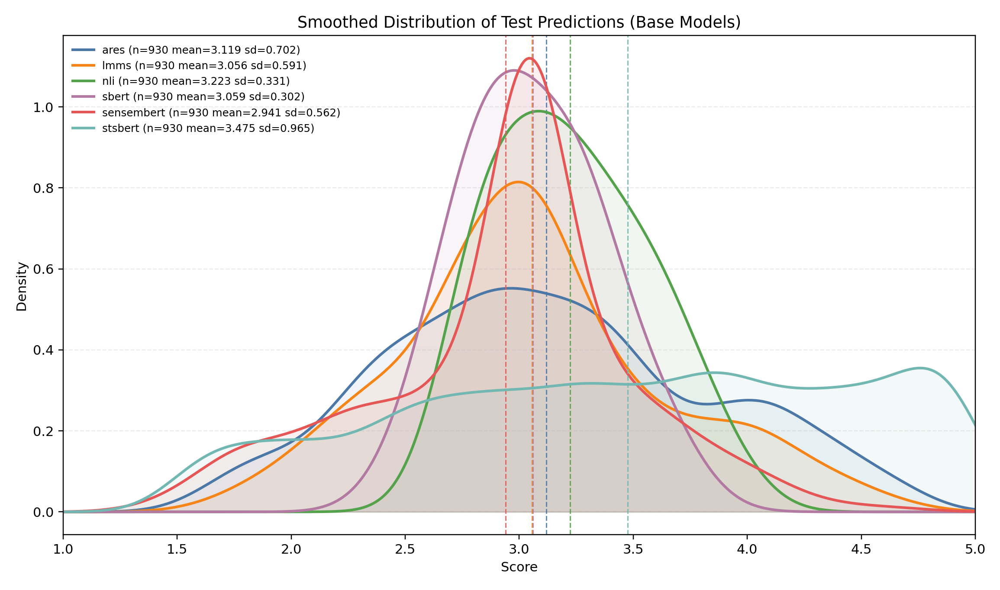
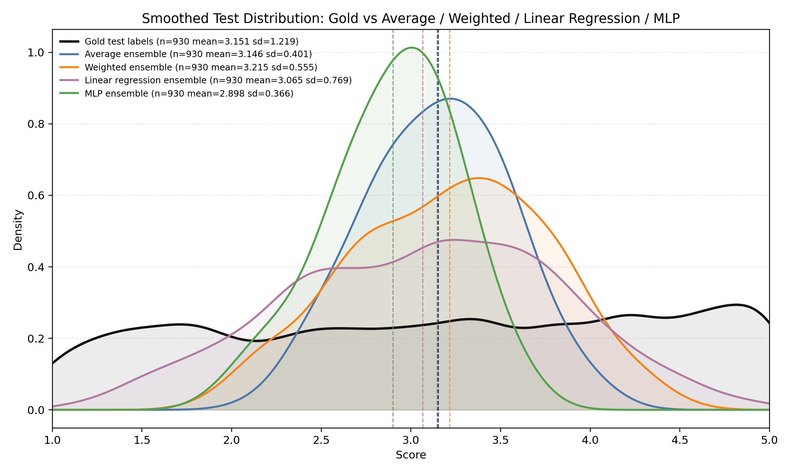
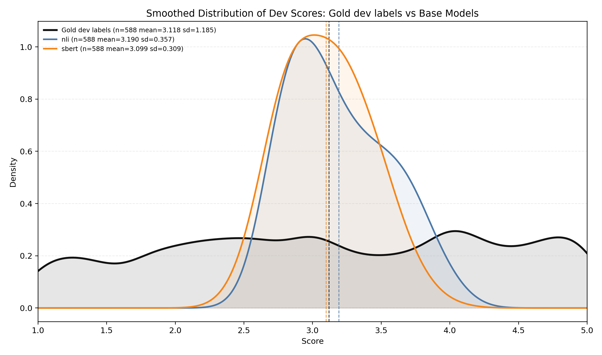
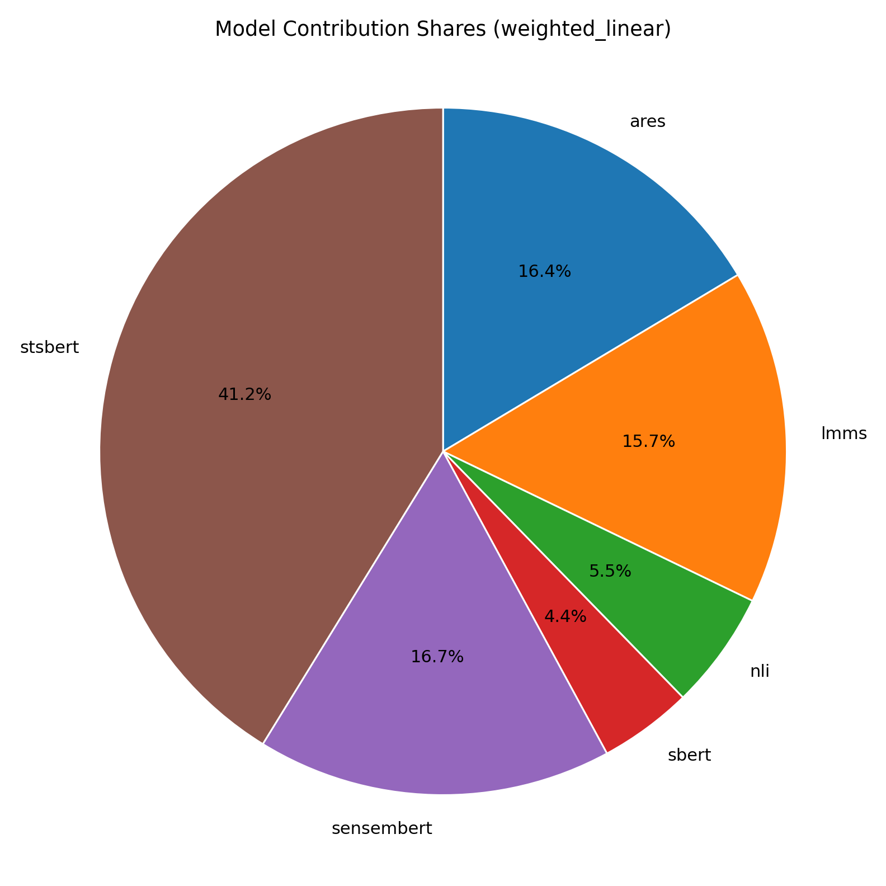
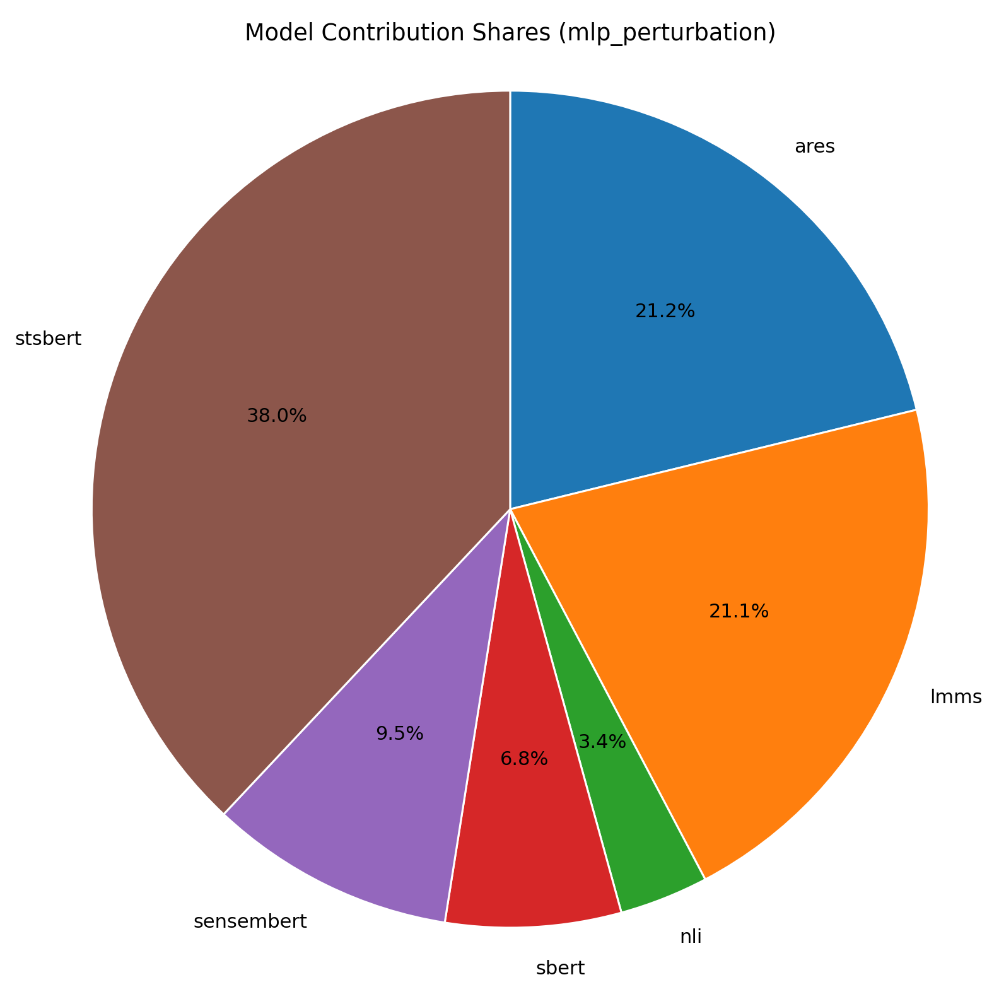

# SemEval 2026 Task 5 UTN
This repository contains an ensemble expert system for word sense prediction (SemEval 2026 Task 5).  
It trains several base experts, exports their `dev`/`test` predictions, and combines them using ensemble methods.

Base experts:
- ARES feature expert
- LMMS feature expert
- SensEmBERT feature expert
- NLI expert
- SBERT expert
- Cross-encoder expert (`stsbert` naming in prediction files)

Ensemble methods:
- Average
- Weighted average
- Linear regression
- MLP

## Table of Contents
- [Team Responsibilities](#team-responsibilities)
- [Setup and Installation](#setup-and-installation)
- [How to Run the Model](#how-to-run-the-model)
- [Results & Evaluation](#results--evaluation)


## Team Responsibilities
- **Noas Shaalan**: ARES/LMMS/SensEmBERT feature pipelines and CORAL MLP experts, linear-regression ensemble component.
- **Adam Jen Khai Lo**: cross-encoder expert implementation.
- **Moritz Rengert**: training/evaluation infrastructure, NLI and SBERT experts, ensemble framework (average/weighted/MLP), shared utilities.


## Setup and Installation
1. Clone and enter the repo:
```bash
git clone --recurse-submodules git@github.com:moritzrengert/semeval2026_task_5_utn.git
cd semeval2026_task_5_utn
git submodule update --init --recursive
```

2. Create a virtual environment and install dependencies:
```bash
python3 -m venv .venv
source .venv/bin/activate
pip install -r requirements.txt
```

3. Ensure annotated dataset files exist at:
- `semeval26-05-scripts/data/train.json`
- `semeval26-05-scripts/data/dev.json`
- `semeval26-05-scripts/data/test.json`

4. Feature experts require precomputed feature tensors at:
- `src/ares_expert/ares_context_features.pt`
- `src/lmms_expert/lmms_context_features.pt`
- `src/sensembert_expert/sensembert_context_features.pt`

<details>
  <summary>If missing, generate them using these instructions:</summary>
> ⚠️ **This applies only to the expert models for ARES, LMMS, and SensEmBERT.**

Note: We have provided the extracted features as .pt files. However, in order to recreate these features, you must first download the pre-trained vectors from the sources listed below.

### ARES Expert
Vectors Source: https://nlp.uniroma1.it/sensembert/

To run:
1. Extract features: `python ares_expert/prep_features_final.py`
2. Train model: `python ares_expert/train_mlp_final.py`

### LMMS Expert
Vectors Source: https://figshare.com/articles/dataset/LMMS_2019_/21977219

To run:
1. Extract features: `python lmms_expert/prep_features_final.py`
2. Train model: `python lmms_expert/train_mlp_final.py`

### SensEmBERT Expert
Vectors Source: https://nlp.uniroma1.it/sensembert/

To run:
1. Extract features: `python sensembert_expert/prep_features_final.py`
2. Train model: `python sensembert_expert/train_mlp_final.py`

### General Instructions
- Ensure your environment is set up with PyTorch and the required dependencies.
- All scripts use shared utilities from the parent directory.
- Before running the training scripts, ensure the context features have been extracted or are already present in the folder.
</details>


## How to Run the Model
Run from repository root.

### 1. Train all base experts and write prediction JSON files:
```bash
python3 train_all_experts.py
```

This writes:
- `predictions/dev_preds_ares.json`
- `predictions/dev_preds_lmms.json`
- `predictions/dev_preds_nli.json`
- `predictions/dev_preds_sbert.json`
- `predictions/dev_preds_sensembert.json`
- `predictions/dev_preds_stsbert.json`
- `predictions/test_preds_*.json` for the same models

### 2. Train/evaluate all ensemble methods on those predictions:
```bash
python3 train_all_ensembles.py
```

This runs `average`, `weighted`, `linear_regression`, and `mlp`, and writes:
- `predictions/dev_preds_ensemble_<method>.json`
- `predictions/test_preds_ensemble_<method>.json`
- `predictions/meta_<method>.json`
- `predictions/contrib_<method>.json` (when available)

### 3. Optional: run a single ensemble method directly:
```bash
python3 src/ensemble/ensemble.py --combine weighted --show-contributions
```

## Results & Evaluation
The numbers below are computed on:
- Dev: `semeval26-05-scripts/data/dev.json` (`n=588`)
- Test: `semeval26-05-scripts/data/test.json` (`n=930`)

Reported metrics:
- `Spearman` (rank correlation, higher is better)
- `MAE` (mean absolute error, lower is better)
- `Acc-within-SD` (prediction within human mean +/- std or within +/- 1.0, higher is better)

### Base Experts (Test)
| Model | Spearman | MAE | Acc-within-SD |
|---|---:|---:|---:|
| `ares` | 0.5040 | 0.8756 | 0.6763 |
| `sensembert` | 0.4855 | 0.9215 | 0.6258 |
| `stsbert` | 0.4627 | 0.9436 | 0.6796 |
| `lmms` | 0.4492 | 0.9093 | 0.6376 |
| `nli` | 0.2500 | 1.0052 | 0.5548 |
| `sbert` | 0.1877 | 1.0330 | 0.5570 |

### Ensemble Comparison
| Ensemble | Dev Spearman | Test Spearman | Test MAE | Test Acc-within-SD |
|---|---:|---:|---:|---:|
| `average` (`predictions/test_preds_ensemble_average.json`) | 0.5725 | **0.6199** | 0.8731 | 0.6172 |
| `linear_regression` (`predictions/test_preds_ensemble_linear_regression.json`) | **0.5844** | 0.6052 | **0.8076** | **0.7269** |
| `mlp` sweep-best (`predictions/ensemble_sweep_runs/test_mlp_06.json`) | 0.5631 | 0.6014 | 0.9190 | 0.6022 |
| `weighted` sweep-best (`predictions/ensemble_sweep_runs/test_weighted_12.json`) | 0.5739 | 0.5960 | 0.8378 | 0.6753 |
| `mlp coral+mse` sweep-best (`predictions/ensemble_sweep_runs/test_mlp_coral_mse_04.json`) | 0.5467 | 0.5496 | 0.8452 | 0.6946 |

### Contribution Shares (Test, |contribution|)
| Model | Weighted (best) | MLP (best) | MLP CORAL+MSE (best) |
|---|---:|---:|---:|
| `ares` | 16.4% | 21.2% | 20.5% |
| `lmms` | 15.7% | 21.1% | 9.9% |
| `nli` | 5.5% | 3.4% | 7.5% |
| `sbert` | 4.4% | 6.8% | 14.6% |
| `sensembert` | 16.7% | 9.5% | 6.5% |
| `stsbert` | 41.2% | 38.0% | 41.1% |

### Key Figures
Base-model test distributions:



Gold vs ensemble test distributions (`average`, `weighted`, `mlp`):



Dev gold vs NLI/SBERT (why these two contribute less):



Weighted and MLP contribution pies:




### Insights
1. As single experts, `ares` is the strongest by test Spearman (0.5040), but all base models remain clearly below the best ensembles.
2. Ensembling gives a large gain in ranking quality: `average` reaches the best test Spearman (0.6199), about +0.116 absolute over the best base model.
3. The best calibration/error profile is from `linear_regression` (best MAE 0.8076 and best Acc-within-SD 0.7269), even though its Spearman is slightly below `average`.
4. Contribution analysis is consistent across methods: `stsbert` is the dominant signal (~38-41%), with `ares` and `lmms` as secondary contributors; `nli` and `sbert` have the smallest shares.
5. Distribution plots show a remaining challenge: ensemble predictions are still narrower than the gold label distribution, so ranking improves strongly, but score spread/calibration can still be improved.
